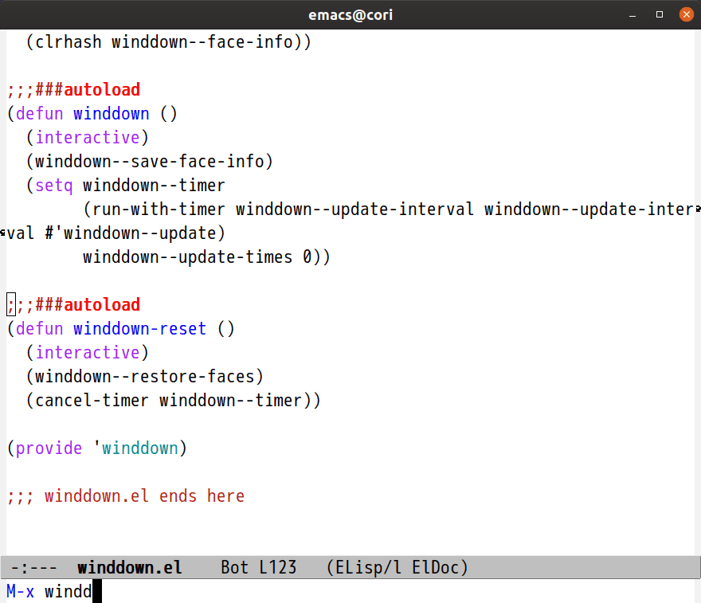
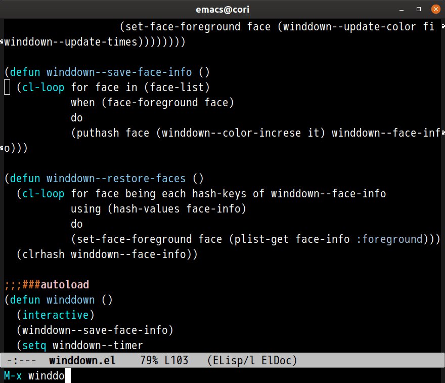

# winddown.el

Emacs port of [VSCode extension vscode-winddown](https://github.com/schneefux/vscode-winddown)
winddown.el slowly fades out the colors

## Image

### right theme

### dark theme

## Commands

### `M-x winddown`

Start

### `M-x winddown-clear`

Stop and clear timer

## Customize variable

### `winddown-work-minutes` (Default: 25)

work time minutes
